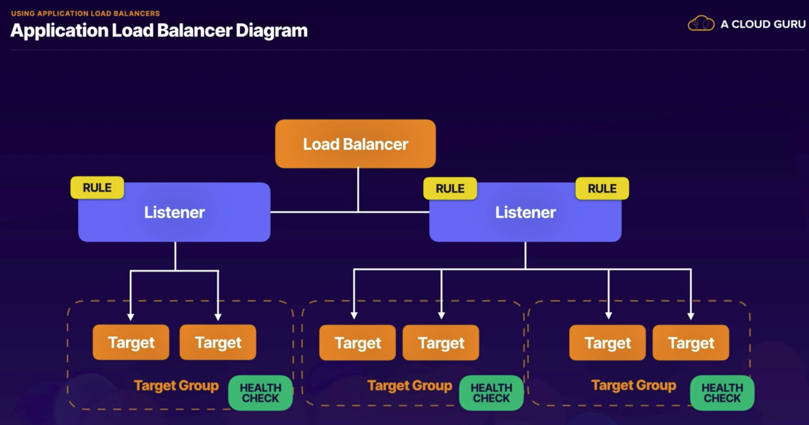

# Elastic Load Balacing
## Overview
ELB automatically distributes incoming application traffic across multiple targts, such as Amazon EC2 instances. This can be done across multiple AZs.
There are 3 different types of load balancer:
- Application Load Balancer: Best for balancing of HTTP and HTTPS traffic. They operate at layer 7 and are application-aware. Intelligent Load Balancer
- Network load Balancer: Operating at the connection level at layer 4. They handle millions of requests per second while maintaining ultra low latency. Performance Load Balancer.
- Classic load Balancer: Legacy Load Balancer for classic/test/dev. 

The status of the instances that are healthy at the time of the health check is InService otherwise the status is OutOfService. The load balancer performs health checks on all registered instances. It then routes requests only to the healthy instances. The routing resumes to instances when it has been restored to the healthy state.

## Application Load Balancer

### Layer 7 load Balancing
An application Load Balancer functions at the Application layer -- the 7th layer of the Open Systems Interconnection (OSI) model.
### Listeners
A listener checks for connection requests from clients using the protocol and port you configure.
### Rules
You must define a default rule for each listener and you can optionally define additional rules. When the conditions for a rule are met, then the actions are performed.
### Target Groups
Each target group routes requests to one or more registered targets, such as EC2 instances, using the protocol and port number you specify.
### Path-Based Routing
You can do intelligent routing based on your paths.

## Network load Balancer
Operates at layer 4 of the OSI and can handle millions of requests per second.
If no instance is healthy it'll send a request to all instances in the hope one responds.

## Classic Load Balancer
### Sticky session
A Classic load balancer route each request independently to the resgistered EC2 instance with the smallest load. Sticky session allow you to bind a user's session to a specific EC2 instance. It is useful for storing information locally to that instance.

## Deregistration delay
It allows load balancer to keep existing connections open for a set period of time even if the instance is re-registered or unhealthy. This allow continuity but if you want your load balancer to immediately close connections you can disable deregistration.